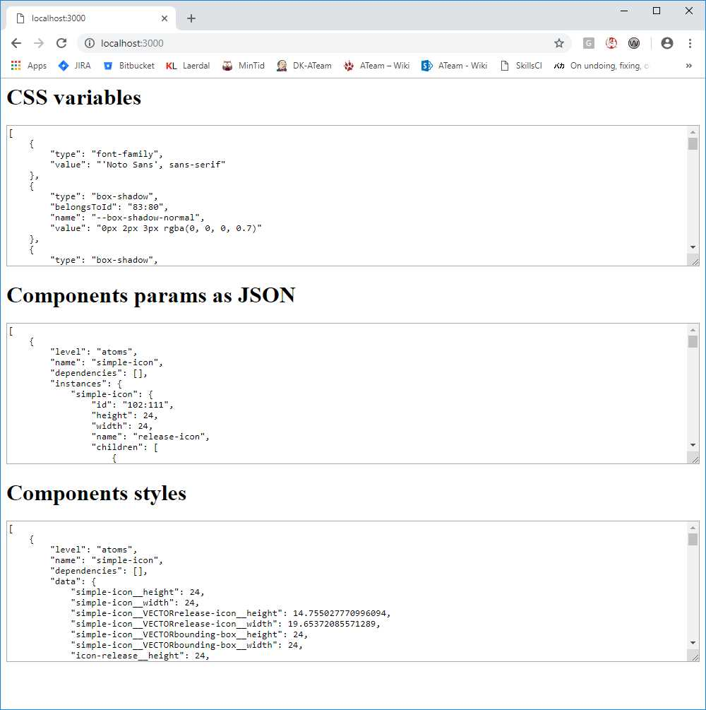
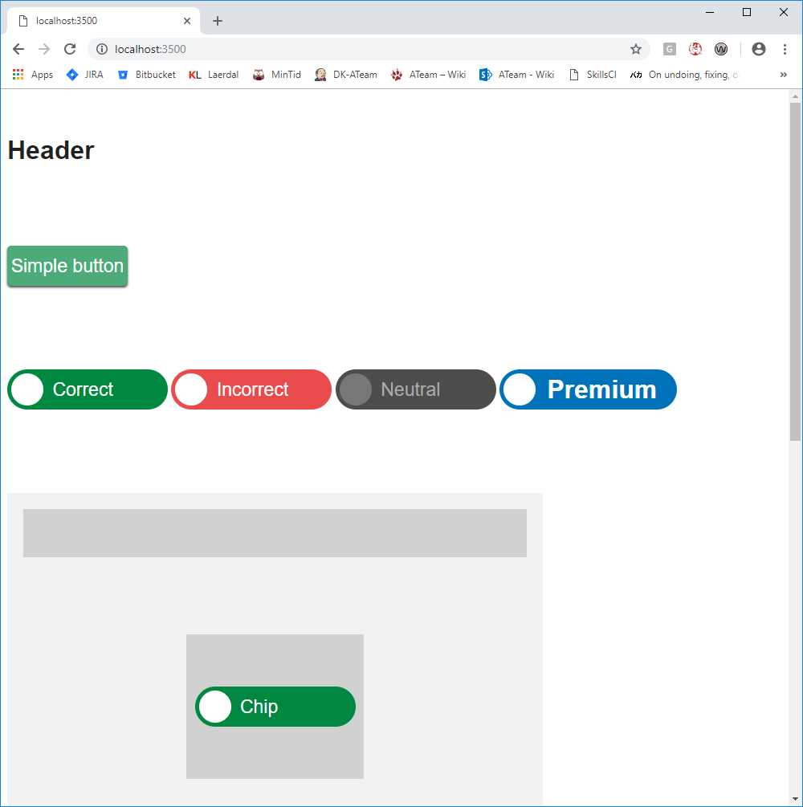

# design-exporter

## Description

The design-exporter is a small tool to download a Figma design file and create polymer components that correspond to the design.
The ccurent version is a proof of concept.

## Prerequisites

The design-extracor needs the following problems to function:

* [Node.js](https://nodejs.org/dist/v10.15.0/)
* [npm](https://www.npmjs.com/)
* [Polymer](https://www.polymer-project.org/). Install it with `npm install polymer-cli --global`. Polymer is only used for the demo page and can be left out if needed.
* [git](https://git-scm.com/)

## Setup

To setup:

1. Clone the repository [desk-configurator](https://bitbucket.org/laerdalmedical/design-exporter/src/master/) in a folder somewhere.

2. Install the needed packages for the exporter and the test app:
    ```bash
    cd design-exporter
    npm install
    ```
    and
    ```bash
    cd design-exporter/testapp
    npm install
    ```

## How to run

### The exporter

To start the exporter run:

```bash
node app
```

This will now start a webserver running on port 3000. To download and extract the design file, open a browser and go to the following address:

```bash
http://localhost:3000
```

When you refresh the page, the design-exporter will download the Figma file from the cloud and produce a number of components that can easily be implemented in the the skills application.
The created components are stored in the folder `/testapp/build`



### The demo page

To start the demo page, open another terminal and run

```bash
cd /design-exporter/testapp
polymer serve
```

This will run another web server, most likely on port 8081 and display a page with the design imported from Figmna.


## How it works

### Example output from Figma

```json
HTTP/1.1 200 OK
Server: nginx
Date: Tue, 22 Jan 2019 07:06:26 GMT
Content-Type: application/json; charset=utf-8
Transfer-Encoding: chunked
Connection: keep-alive
Keep-Alive: timeout=20
Vary: Accept-Encoding
Access-Control-Allow-Origin: *
Access-Control-Allow-Headers: Content-Type, X-Figma-Token, Authorization
X-Uncompressed-Content-Length: 491294
Content-Encoding: gzip

{
  "name": "NORTH STAR - The Laerdal Design System (test)",
  "lastModified": "2019-01-21T16:11:55.205905Z",
  "thumbnailUrl": "https://s3-alpha-sig.figma.com/thumbnails/78e1fb65-456e-4a84-bb5d-b2e3527675af?Expires=1549238400&Signature=JV3-DVRN6ZuQuUuxseHs1ruMTHn8VFDrwkUMnpnLmYWvaqROxEX8vrrKn5~hdRwBIQ93SS7-NHSSgyyagPAhOfcx64iWLv0YFnlFSgEQOwvIlI2FCNnUkb-KgaOB32oYyDuC5mQQ2JtVvkxJZ6qOYHsGMNNdqOdzefHMBijrif4v9ZmQjlrjVupm2ZRFvikjIjpzKikIFAvSSQMcnRu3JYZInj8Ls9awoNSLsas84sxNjejFu~H3FE6WyXxvJsb3dnKs0p46lxarsEMD8xQpqa4MnoQj8mXTeyX22zkZP-ke-bokkBmVGskReZItSi4XxG7-Ja-GSgJh2dv-HWj0Wg__&Key-Pair-Id=APKAINTVSUGEWH5XD5UA",
  "version": "104442455",
  "document": {
    "id": "0:0",
    "name": "Document",
    "type": "DOCUMENT",
    "children": [
      {
        "id": "0:1",
        "name": "Page 1",
        "type": "CANVAS",
        "children": [
          {
            "id": "152:0",
            "name": "TEMPLATES-2",
            "type": "FRAME",
            "blendMode": "PASS_THROUGH",
            "children": [
              {
                "id": "152:1",
                "name": "button-rectangle",
                "type": "INSTANCE",
                "blendMode": "PASS_THROUGH",
                "children": [
                  {
                    "id": "I152:1;79:22",
                    "name": "button-box",
                    "type": "RECTANGLE",
                    "blendMode": "PASS_THROUGH",
                    "absoluteBoundingBox": {
                      "x": 6017,
                      "y": -2040,
                      "width": 150,
                      "height": 50
                    },
                    "constraints": {
                      "vertical": "CENTER",
                      "horizontal": "SCALE"
                    },
                    "fills": [
                      {
                        "type": "SOLID",
                        "blendMode": "NORMAL",
                        "color": {
                          "r": 0.2980392156862745,
                          "g": 0.6705882352941176,
                          "b": 0.4745098039215686,
                          "a": 1
                        }
                      }
                    ],
                    "strokes": [],
                    "strokeWeight": 1,
                    "strokeAlign": "INSIDE",
                    "styles": {
                      "fill": "83:23",
                      "effect": "83:80"
                    },
                    "effects": [
                      {
                        "type": "DROP_SHADOW",
                        "visible": true,
                        "color": {
                          "r": 0,
                          "g": 0,
                          "b": 0,
                          "a": 0.6980392156862745
                        },
                        "blendMode": "NORMAL",
                        "offset": {
                          "x": 0,
                          "y": 2
                        },
                        "radius": 3
                      }
                    ],
                    "cornerRadius": 5,
                    "rectangleCornerRadii": [
                      5,
                      5,
                      5,
                      5
                    ]
                  }
                ]
              }
            ]
          }
        ]
      }
    ]
  }
}
```

### Example of a template

```JavaScript
<!-- EXPORTER_DEPENDENCIES -->
const template = document.createElement('template');
template.innerHTML = `
    <style>
        :host {
            display: block;
            color: var(${TEXT__color});
            font-size: var(${TEXT__font-size});
            font-weight: var(${TEXT__font-weight});
            min-width: ${width}px;
            min-height: ${height}px;
        }
    </style>
    <slot></slot>
`;

class <!-- EXPORTER_COMPONENT_CLASS_NAME --> extends HTMLElement {

    static get is() {
        return '<!-- EXPORTER_COMPONENT_NAME -->';
    }

    constructor() {
        super();
    }

    connectedCallback() {
        if (!this.shadowRoot) {
            this.attachShadow({mode: 'open'}).appendChild(template.content.cloneNode(true));
        }
    }

}

customElements.define(<!-- EXPORTER_COMPONENT_CLASS_NAME -->.is, <!-- EXPORTER_COMPONENT_CLASS_NAME -->);
```

### Example of a generated button

```JavaScript
import '../_primitives/rectangle.js';
import '../_primitives/text-block.js';
const template = document.createElement('template');
template.innerHTML = `
    <style>
        :host {
            display: inline-block;
            cursor: pointer;

            height: 50px;
            min-width: 150px;
        }

        :host atom-rectangle {
            background-color: var(--color-correct-2);
            border: unset;
            border-radius: 5px;
            box-shadow: var(--box-shadow-normal);
            color: var(--color-white);
            font-size: var(--text-medium-300--font-size);
            font-weight: var(--text-medium-300--font-weight);

            box-sizing: border-box;
        }

        text-block {
            width: 100%;
        }

        :host(:hover) atom-rectangle {
            background-color: var(--color-correct-1);
            border: 3px solid var(--color-incorrect-1);
            border-radius: 5px;
            box-shadow: var(--box-shadow-hover);
            color: var(--color-white);
            font-size: var(--text-medium-300--font-size);
            font-weight: var(--text-medium-300--font-weight);
        }

        :host(:active) atom-rectangle {
            background-color: var(--color-white);
            border: 1px solid var(--color-grey-1);
            border-radius: 30px;
            box-shadow: var(--box-shadow-normal);
            color: var(--color-correct-1);
            font-size: var(--text-medium-300--font-size);
            font-weight: var(--text-medium-300--font-weight);
        }

        :host(:focus) atom-rectangle {
            background-color: var(--color-grey-3);
            border: 3px solid var(--color-brand);
            border-radius: 5px;
            box-shadow: var(--box-shadow-hover);
            color: var(--color-white);
            font-size: var(--text-medium-300--font-size);
            font-weight: var(--text-medium-300--font-weight);
        }

        :host(:disabled) atom-rectangle {
            background-color: var(unset);
            border: 2px solid var(--color-grey-4);
            border-radius: 5px;
            box-shadow: var(unset);
            color: var(--color-grey-4);
            font-size: var(--text-medium-300--font-size);
            font-weight: var(--text-medium-300--font-weight);
        }
    </style>
    <atom-rectangle>
        <text-block>
            <slot></slot>
        </text-block>
    </atom-rectangle>
`;

class ButtonRectangle extends HTMLElement {

    static get is() {
        return 'button-rectangle';
    }

    constructor() {
        super();
    }

    connectedCallback() {
        if (!this.shadowRoot) {
            this.attachShadow({mode: 'open'}).appendChild(template.content.cloneNode(true));
        }
    }

}
customElements.define(ButtonRectangle.is, ButtonRectangle);
```
